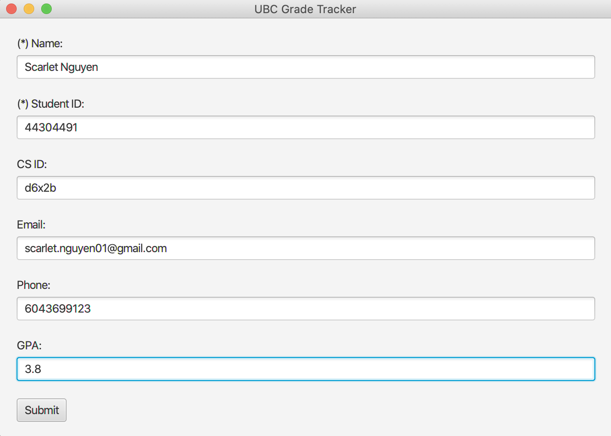
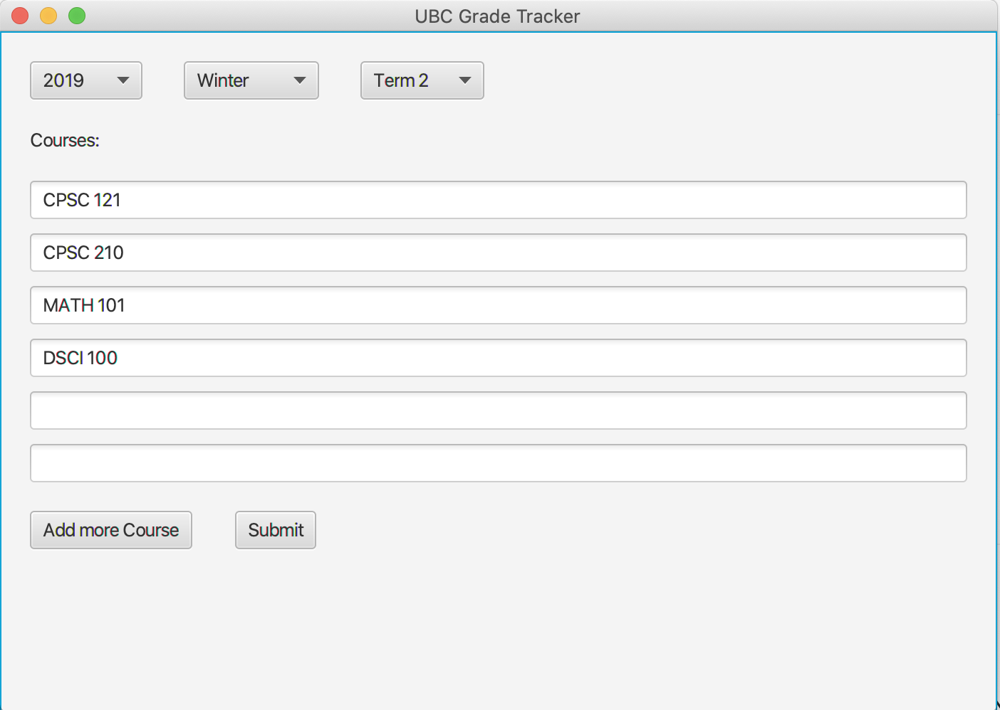
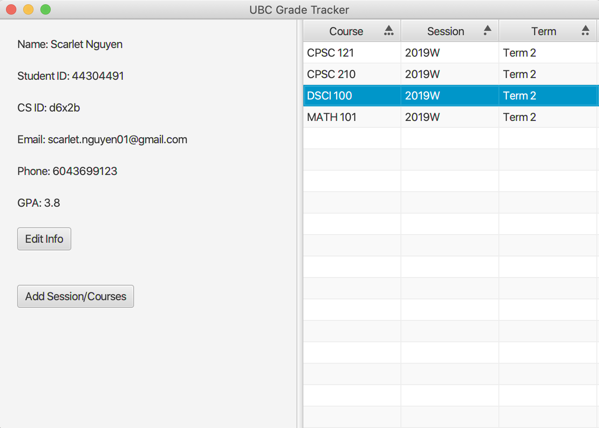
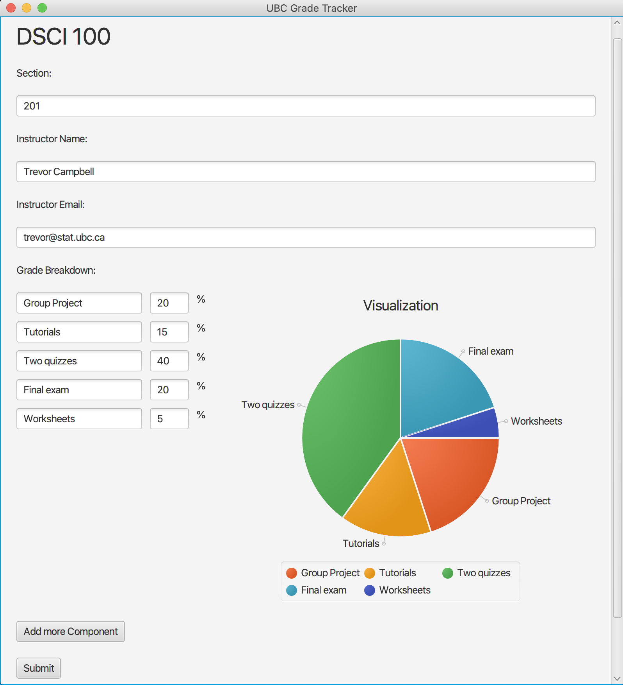

# UBC Grade Tracker

## Project Description

*Tired of manually logging in to SSC? Sick of missing deadlines and losing tracks 
of your grades?* Yes, we feel your pain. That's why here's an app that would programmatically 
done all of the redundant, time-consuming tasks for every UBC student.

With **simple user interface** and login only *once* to the app, we will keep you **up to
date** with everything on SSC and let you organize your courses as well as personal
projects with multiple sets of todo lists and associated deadlines and URLs to
assignments.  

## User Story

- As a user, I want to store my UBC-related information
- As a user, I want to be able to add sessions/terms/courses to my profile
- As a user, I want to access my information using UI
- As a user, I want to edit my information using the UI

- As a user, I want to be able to save my student information to file
- As a user, I want to be able to load my my student information 
 from file when the program starts
 
## Instructions for Grader

GUI Location: all visual components locate inside *ui/GradeTrackerUI.java* file.

#### Screen Description (in order listed below): 

1. **Info Screen**: the screen that takes user's basic information such as name, 
student ID, CS ID, phone, email, etc. Name and student ID are required to enter
the dashboard. Pressing the **Submit** button will either:
    - Pop up an alert if the user has not entered the name or student ID.
    - Otherwise, proceed to next screen.

    
  
    
2. **Session Screen**: the screen that let user add sessions/courses. It takes the session's
year, term, and courses within that session. If all course fields are empty, no new session
is created. Press **Submit** button to proceed.

    
  

3. **Dashboard Screen**: the screen that displays all user's information so far. From
this screen, the user can:
    -  Edit personal information: press **Edit Info** button to update user's information.
        > Proceed to Info Screen
    -  Add Session/Courses: press **Add Session/Courses** button to add more session or
    update current session(s) with more courses.
        > Proceed to Session Screen
    - Update individual course information: double-click to any of the course row in the
    course table to edit/update the course information. 
        > Proceed to Course Info Screen
 
    At anytime the user wants to back to the Dashboard Screen, simply press **Submit**
    button, but please be aware that the current state on the screen at the moment of pressing
    will be saved as well.
    
    
            
     
4. Course Info Screen: the screen that displays and let user update the course's information 
such as course's section, instructor, components, etc.
    - To edit course: fill out the fields and press the **Submit** button.
    - To remove course: press the **Remove course** red button at the very
end of the screen.  
    *Note*: the user will not see course's components visualization's update until submit
    and come back later.

    
  
       
#### Data Persistence                              
> All user data including personal information, sessions, and courses will be automatically
> encoded and saved in a JSON format .txt file located in data folder whenever the user closes
> the application. The data will automatically be decoded and proceed to the Dashboard Screen
> right the way when the user opens the application anytime again after the first time.                                                                                                      

## Phase 4: Task 2
   - *Test and design a class that is robust*: I design the FileHandler file that has:
        - method **write()** that throws IOException
        - method **read()** that  throws IOException and ClassNotFoundException
        - the two methods above are tested thoroughly in FileHandlerTest, 
        each has one test for the case where the exception is expected and 
        another where the exception is not expected
   - *Include a type hierarchy in your code*: I have the class Instructor and Student both 
   extends the abstract class Person
   - *Make appropriate use of the Map interface somewhere in your code*: I implement the 
   HashMap data structure to store the Course and the Term altogether inside the Session model.
   - *Make appropriate use of a bi-directional association somewhere in your code*: I have a 
   bi-directional association in 2 places: 
        - Course and Session
        - TodoItem and CourseComponent

## Phase 4: Task 3    
   - Before, the Student and Instructor models did not extend anything and they have 
   duplicate code for the name and email fields. So I added an abstract Person class that 
   is the supertype for both Student and Instructor. As a result, I don't have to store the 
   name and email fields, as well as getters and setters for those fields, individually in 
   the Instructor or Student model anymore.
   - I used to have the Term model. The previous structure looks like this:
        - Student has a list of Sessions
        - Each Session has a list of Terms
        - Each Term has a list of Courses
        - Each Course has a list of CourseComponents
      
        but I realized that this structure would make it really hard to retrieve any 
        information from student because I have to iterate some lists everytime I
        need something, and the Term doesn't necessarily store a list of Courses.
        As a result, I removed the Term model and turn it into a simple String. 
        Along with the use of HashMap and unique course code, I can now associate 
        any course with a term in a Session without having to iterate through triple 
        for-loops.                                                                                                                                                                                                                